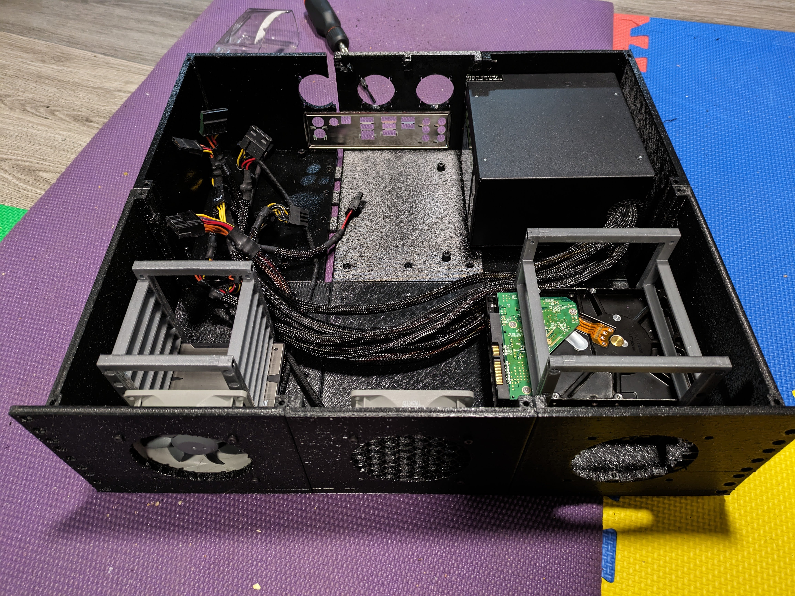

# 3D Printable Rackmount PC/Server Case using [OpenSCAD](https://openscad.org/).
## WIP
The goal of this project originally was to create OpenSCAD modules of PC components to facilitate the design of a modular rack-mountable computer chassis. But once that was complete, I began designing a chassis and somewhere to store it; so for now, here we are. 2.5 versions in and I still feel like this is very much a work in progress. As I complete test prints, and have new ideas, I will continue to iterate on the case design.

## Notes
### V1
While doing a full test print/fit, there were several issues with warping (especially the corner pieces) and cracking when transitioning from printing floor + walls to just the walls. However, they didn't seem to affect the build at all. The rear wall was the most fragile with fan/io/psu cutouts and some chunkier pieces to bolt sections together; I had one of those chunky pieces break off, and some issues with support material not cooperating while printing. The honeycomb fill needs some work, while nocking out its support material, most of the honeycomb broke off on 2 of the 3 fan openings.  The 3U test case is currently mounted in my rack with x4 Rack Studs in the center of the first and third 'U's. It has been extremely stable, however I still have concerns about the PSU somewhat unsupported at the rear of the case.

#### Exporting (batch file)
```
export.bat [options] main.scad
Allowed options:
	-t arg		Specifies the type of file to export: stl, png (may be used multiple times)
	-m arg		Specifies the type of model to export: cage, joinery, rack (may be used multiple times)
	-h arg		0 will remove the honeycomb fill, 1 will keep it.
```



### V2 & V2-Compact
A complete redesign has enebled me to mitigate most of the cracking, warping, and support issues by building panels rather than sections. This means all of the panels can be printed flat on the build plate and the hex sections come out quite well. I moved the PSU to the front of the case, which required standing it on it's side to fit beside an ATX mainboard within a 19" rack. That also means I've had to go from a 3U design to a 4U to fit it on it's side, and you'll need to plug it in at the front. However, all of the heavy components are now at the front of the case, close to the supports, which has allowed some thinner walls and a somewhat simpler system of joining the panels together.

The compact version of the V2 case is almost identical. The most obvious difference is that the HDDs are mounted above the mainboard, allowing the case depth to be reduced by about 115mm


#### Exporting (bash file)
```
Usage: ${0} [OPTION [ARGUMENT]]... main.scad

OPTIONS:
    -o, --out_path <filepath>                      Specify the output file path. Default: ./export
    -i, --in_file <filename>                       Specify the input .scad file. Default: main.scad
    -p, --panel front|left|right|top|bottom|back   Specify which panel to render.
    -j, --joinery                                  A toggle to render the joinery instead of the panel for the specified panel.
    -c, --cage                                     A toggle to render the HDD cage instead of any other geometry.
    -r, --resolution <value>                       The resolution of the exported .png thumbnail. Default: 1024.
    -a, --all                                      Exports all geometry. NOTE: very hardware intensive.
    -s                                             Exports an exploded view screenshot.
    -h, --help                                     Print this help message.
```

## Modules
Many of the modules approximate the physical dimensions of various PC components. These are used to estimate positions and clearances of all the printable parts. Most of the dimensions were pulled from spec sheets online, and the rest were measured from physical pc hardware.
### mainboard.scad
- ATX and Micro ATX models.
### psu.scad
- ATX model.
### hdd.scad
- 2.5" SSD & 3.5" HDD models.
### fan.scad
- 140mm, 120mm, 92mm, 80mm, 70mm, 60mm, 50mm, 40mm models and through holes for mounting and ducting.

## TODO
- support other mainboard formats (currently only mATX and ATX).
- support other PSU formats (currently only ATX).
- add more and better code comments
- ...
