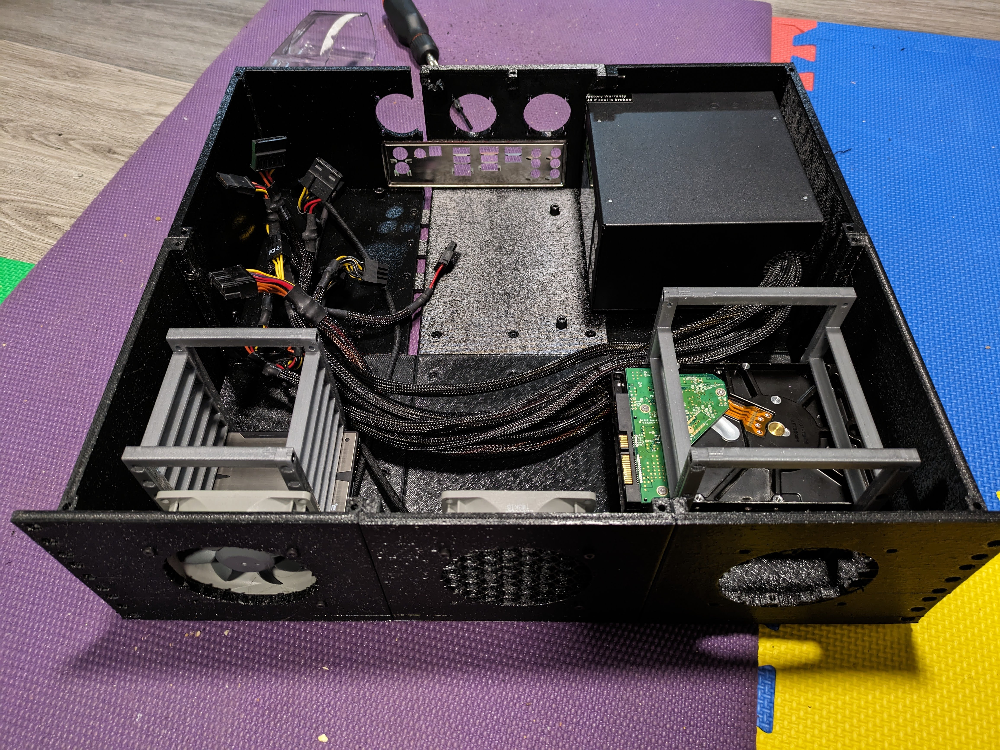

# 3D Printable Rackmount PC/Server Case using OpenScad.
## WIP
The goal of this project is to create [OpenSCAD](https://openscad.org/) modules to facilitate the design of a modular rack-mountable computer chassis. It has been heavily inspired by https://www.printables.com/model/485778-mini-itx-server-rackmount-2u 
## Requirements
- OpenSCAD
- [nutsnbolts](https://github.com/JohK/nutsnbolts) library for fasteners.
- honeycomb library for the honeycomb texture used on fan openings.




## Exporting
```
export.bat [options] main.scad
Allowed options:
	-t arg		Specifies the type of file to export: stl, png (may be used multiple times)
	-m arg		Specifies the type of model to export: cage, joinery, rack (may be used multiple times)
	-h arg		0 will remove the honeycomb fill, 1 will keep it.
```
## Modules
Many of the modules approximate the physical dimensions of various PC components. These are used to estimate positions and clearances of all the printable parts. Most of the dimensions were pulled from spec sheets online, and the rest were measured from physical pc hardware.
### mainboard.scad
- ATX and Micro ATX models.
### psu.scad
- ATX model.
### hdd.scad
- 2.5" SSD & 3.5" HDD models.
- additionally, modules to generate drive cages.
### fan.scad
- 120mm, 92mm, 80mm, 70mm, 60mm, 50mm, 40mm models and through holes for mounting and ducting.
### rack.scad
- 19", variable height measured in rack units (some testing is still required).
- contains modules to cut up the rack into printable sections.
- This is the place you want to make changes to the layout
### main.scad
- main script interface; has some variables to control which printable part to render.

## TODO
- design the top panel
- support PCI expansion cards in the rear wall
- support other mainboard formats (currently only micro ATX in 2 configurations and ATX in 1 configuration).
- support other PSU formats (currently only ATX in 2 configurations).
- support various rack depth and height configurations
- add code comments
- add export script for non-windows machines

## Notes
While doing a full test print/fit, there were several issues with warping (especially the corner pieces) and cracking when transitioning from printing floor + walls to just the walls. However, they didn't seem to affect the build at all. The rear wall was the most fragile with fan/io/psu cutouts and some chunkier pieces to bolt sections together; I had one of those chunky pieces break off, and some issues with support material not cooperating while printing.

I used a Prusa MK3S+ with a 0.6mm nozzle, 0.4mm layer height, 3 perimeters, 15% adaptive cubic infill, and recycled PETG.
