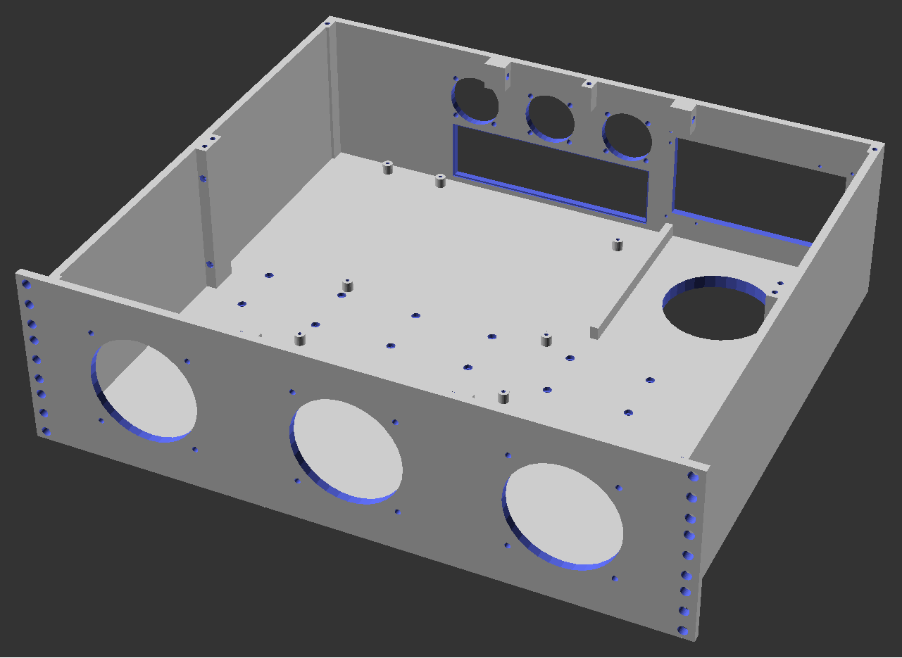

# 3D Printable Rackmount PC/Server Case using OpenScad.
## WIP
The goal of this project is to create [OpenSCAD](https://openscad.org/) modules to facilitate the design of a modular rack-mountable computer chassis. It has been heavily inspired by https://www.printables.com/model/485778-mini-itx-server-rackmount-2u 
## Requirements
- OpenSCAD
- [nutsnbolts](https://github.com/JohK/nutsnbolts) library for fasteners.

## Modules
Many of the modules approximate the physical dimensions of various PC components. These are used to estimate positions and clearances of all the printable parts. Most of the dimensions were pulled from spec sheets online, and the rest were measured from physical pc hardware.
### mainboard.scad
- ATX and Micro ATX models.
### psu.scad
- ATX model.
### hdd.scad
- 2.5" SSD & 3.5" HDD models.
- additionally, modules to generate drive cages.
### fan.scad
- 120mm, 92mm, 80mm, 70mm, 60mm, 50mm, 40mm models and through holes for mounting and ducting.
### rack.scad
- 19", variable height measured in rack units (some testing is still required).
- contains modules to cut up the rack into printable sections.
### main.scad
- main script interface; has some variables to control which printable part to render.

## Exporting .stl Files
On Windows, run 'exportAll.bat' to export all of the printable sections, using main.scad. This can be very resource intensive on systems with limited CPU cores.

## TODO
- design the top panel
- refine drive cage sizing & tolerances
- support PCI expansion cards in the rear wall
- support other mainboard specs
- support other PSU specs
- support various rack depth and height configurations
- add export script for non-windows machines and provide options to export a subset of parts