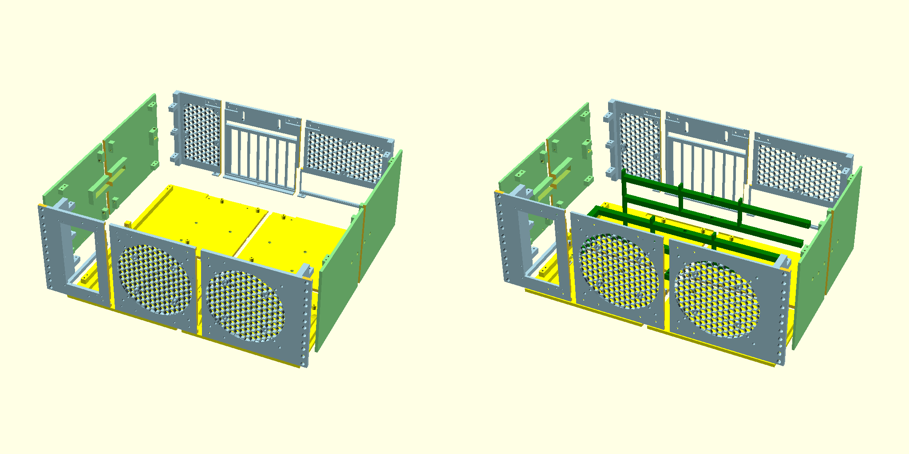

# 3D Printable Rackmount PC/Server Case using [OpenSCAD](https://openscad.org/).
## WIP
The goal of this project originally was to create OpenSCAD modules of PC components to facilitate the design of a modular rack-mountable computer chassis. But once that was complete, I began designing a chassis and somewhere to store it; so for now, here we are. 2.5 versions in and I still feel like this is very much a work in progress. As I complete test prints, and have new ideas, I will continue to iterate on the case design.

## V2 & V2-Compact
A complete redesign has enebled me to mitigate most of the cracking, warping, and support issues by building panels rather than sections. This means all of the panels can be printed flat on the build plate and the hex sections come out quite well. I moved the PSU to the front of the case, which required standing it on it's side to fit beside an ATX mainboard within a 19" rack. That also means I've had to go from a 3U design to a 4U to fit it on it's side, and you'll need to plug it in at the front. However, all of the heavy components are now at the front of the case, close to the supports, which has allowed some thinner walls and a somewhat simpler system of joining the panels together.

The compact version of the V2 case is almost identical. The most obvious difference is that the HDDs are mounted above the mainboard, allowing the case depth to be reduced by about 115mm



### Exporting (bash file)
```
Usage: ${0} [OPTION [ARGUMENT]]... main.scad

OPTIONS:
    -o, --out_path <filepath>                      Specify the output file path. Default: ./export
    -i, --in_file <filename>                       Specify the input .scad file. Default: main.scad
    -p, --panel front|left|right|top|bottom|back   Specify which panel to render.
    -j, --joinery                                  A toggle to render the joinery instead of the panel for the specified panel.
    -c, --cage                                     A toggle to render the HDD cage instead of any other geometry.
    -r, --resolution <value>                       The resolution of the exported .png thumbnail. Default: 1024.
    -a, --all                                      Exports all geometry. NOTE: very hardware intensive.
    -s                                             Exports an exploded view screenshot.
    -h, --help                                     Print this help message.
```
### Post Processing
- I have found that drilling out the M3 through holes with 7/64" drill bit is enough to clean the hole while still maintaining some friction.
- Depending on how severe your elephant's feet get, you may have to sand/scrape any of the mating surfaces to allow proper alignment and fit of sections of panels to be secured together.
### Hardware
#### 3.5" Drive Cage
- x4 M3x8 + nuts; for assembly
- x3 M3x18 (or M3x20), x1 M3x12 + nuts; for mounting
#### Front Panel
- x16 M3x6 (or M3x8) + nuts
#### Left Side Panel
- x4 M3x10 + nuts
